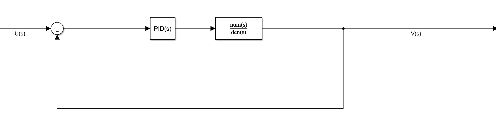
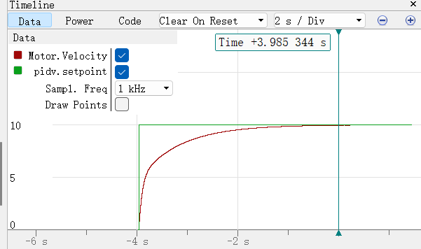
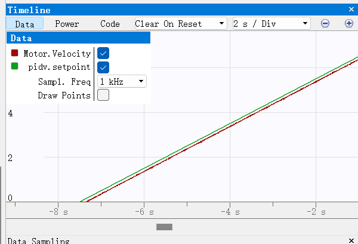
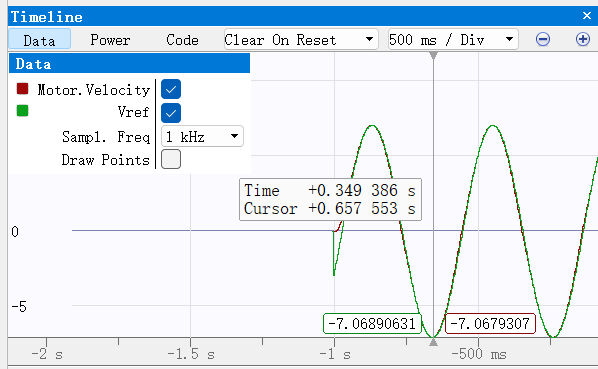
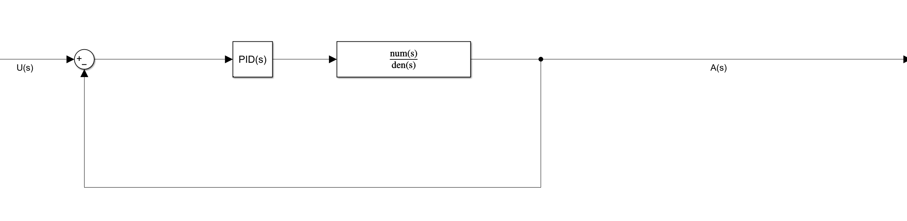
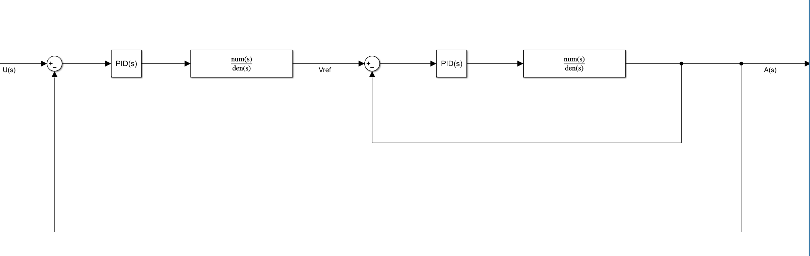
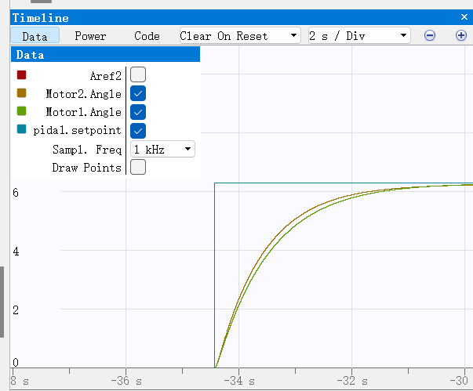
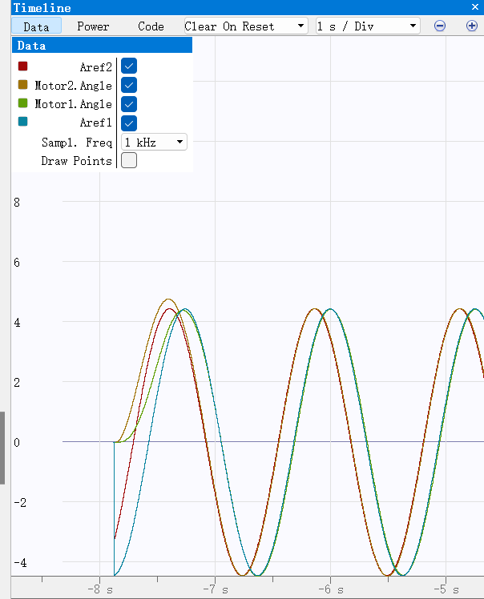
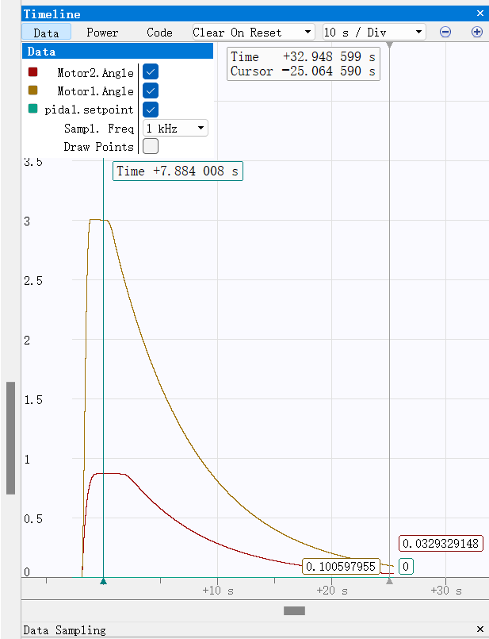

# 电机控制系统仿真实验报告

<center><div style='height:2mm;'></div><div style="font-family:华文楷体;font-size:14pt;">姓名刘雨卓   </div></center>
<center><span style="font-family:华文楷体;font-size:9pt">哈尔滨工程大学创梦之翼战队，电控组，邮箱<br /></span>


## 八字方针：建模 分析 设计 校验

### 一、建模

#### 1.1 确定传递函数形式

电气部分的方程
电机的电气部分由电感$L$、电阻$R$和电压$u$组成。根据基尔霍夫电压定律，可以得到以下方程：
$$
u=L\dfrac{di}{dt}+Ri+E
$$
其中，$E$是反电动势，且
$$
E=K_{e}\omega
$$
因此，电气方程可以写为：
$$
u=L\dfrac{di}{dt}+Ri+K_{e}\omega
$$


机械部分的方程
电机的机械部分由转矩$T$和负载转矩$T_L$组成。电机的电磁转矩$T$与电流$i$之间的关系为：
$$
T=K_t i
$$
根据牛顿第二定律，转动方程为：
$$
J\dfrac{dω}{dt}+Bω=T-T_L
$$
代入$T=K_ti$, 我们得到：


$$
J\frac{dω}{dt}+Bω=K_ti-T_L
$$
我们现在有两个方程：

$$
u = L\frac{di}{dt} + Ri + K_ew，
$$

$$
J\frac{dω}{dt} + Bω = K_ti - T_L
$$

我们假设负载转矩$T_L=0$（空载情况），然后通过拉普拉斯变换得到传递函数。

对电气方程 $u = L$$\frac{di}{dt}$ + $Ri$ + $K_ew$ 进行拉普拉斯变换，得到：

$$
U(s)=(Ls+R)I(s)+K_eΩ(s)
$$
其中，$U(s)$、$I(s)$ 和 $\Omega(s)$ 分别是电压 $u$、电流 $i$ 和角速度 $ω$ 的拉普拉斯变换。

对机械方程 $J$$\frac{dω}{dt}$ + $Bω$ = $K_ti$ 进行拉普拉斯变换，得到：

$$
JsΩ(s)+BΩ(s)=K_tI(s)
$$
从中可以解得：
$$
\Omega(s)=\frac{K_t}{Js+B}I(s)
$$

从电气方程中解出$I(s)$，得到：
$$
I(s)=\frac{U(s)-K_eΩ(s)}{Ls+R}
$$
将$I(s)$代入机械方程得到：
$$
\Omega(s)=\frac{Kt}{Js+B}\cdot\frac{U(s)-K_eΩ(s)}{Ls+R}
$$
整理得到：
$$
\Omega(s)\cdot[Js+B+\frac{K_tK_e}{Ls+R}]=K_tU(s)
$$
最终，可以得到角速度$Ω(s)$与输入电压$U(s)$的传递函数：
$$
G_v(s)=\frac{K_t}{(Js+B)(Ls+R)+K_tK_e}
$$
因为角度是角速度的积分，角度$θ$与角速度$ω$之间的关系为$\theta(s) = \frac{\Omega(s)}{s}$。因此，角度$\theta(s)$的传递函数为：
$$
G_\theta(s) = \frac{1}{s} \cdot \frac{K_t}{(Js + B)(Ls + R) + K_tK_e}
$$


#### <font color=Green>1.2 确定传递函数参数</font>


### 二、分析


#### <font color=Green>2.1 系统开环传递函数根轨迹</font>


#### <font color=Green>2.2 系统开环传递函数伯德图</font>


### 三、设计


#### 3.1 PID控制器的数学表达式

微分方程：
$$
u(t)=K_pe(t)+K_i\int e(t)dt+K_d\frac{de(t)}{dt}
$$
连续传递函数：
$$
G_\mathrm{}(s)=K_p+\frac{K_i}s+K_ds
$$
差分方程：
$$
u_k=u_{k-1}+K_p(e_k-e_{k-1})+K_ie_kT+K_d\frac{(e_k-2e_{k-1}+e_{k-2})}T
$$
离散传递函数：
$$
G_\mathrm{}(z)=K_p+K_i\frac T{z-1}+K_d\frac{z-1}{Tz}
$$


#### 3.2 控制器C语言代码

```c
typedef struct PID
{   
	float i;
	float d; 
    float Kp;
    float Ki;
    float Kd;
    float setpoint;
    float err;
    float last_err;
    float last_last_err;
	float output;
} pid_t;
pid_t pid;
void pid_Init(pid_t *pid){
	pid -> i=0;
	pid -> d=0;
	pid -> Kp=Kp;
	pid -> Ki=ki;
	pid -> Kd=kd;
	pid -> setpoint=0.00;
	pid -> err=0;
	pid -> last_err=0.00;	
	pid -> last_last_err=0.00;
	pid -> output =0;
}
float PID_Calc(float *Measure,float dt){
	  pid.err=pid.setpoint-*Measure;
		pid.i+=pid.err*dt;
		pid.d=(pid.err-pid.last_err)/dt;
		pid.last_last_err=pid.last_err;
		pid.last_err=pid.err;
		pid.output=pid.Kp*pid.err+pid.Ki*pid.i+pid.Kd*pid.d;
	return pid.output;
}
```

#### <font color=Green>3.3 加入控制器后的simulink仿真结构图</font>


#### <font color=Green>3.4 simulink仿真结果</font>


### 四、校验（最重要）


#### 4.1 速度闭环

##### （1）系统框图




##### （2）关键代码

```c
void pidv_Init(pid_t *pid){
	pid -> i=0;
	pid -> d=0;
	if(mode==1&&type==1){
	pid -> Kp=1.00;
	pid -> Ki=2.00;
	pid -> Kd=0.00;
	pid -> setpoint=10.00;
	}
	if(mode==1&&type!=1){
	pid -> Kp=0.65;
	pid -> Ki=0.00;
	pid -> Kd=0.00;
	}
	if(mode==2&&type==1){
	pid -> Kp=8.00;
	pid -> Ki=6.00;
	pid -> Kd=0.00;
	}
	if(mode==2&&type!=1){
	pid -> Kp=8.00;
	pid -> Ki=5.00;
	pid -> Kd=0.00;
	}
	if(mode==3){
	pid -> Kp=3.00;
	pid -> Ki=0.00;
	pid -> Kd=0.00;
	}
	pid -> err=0;
	pid -> last_err=pid -> setpoint;	
	pid -> last_last_err=0.00;
	pid -> output =0;
}
float PID_VCalc(pid_t *pid,float *Measure,float dt){
	  pid->err=pid->setpoint-*Measure;
		pid->i+=pid->err*dt;
		pid->d=(pid->err-pid->last_err)/dt;
		pid->last_last_err=pid->last_err;
		pid->last_err=pid->err;
		pid->output=pid->Kp*pid->err+pid->Ki*pid->i+pid->Kd*pid->d;
	return pid->output;
}
```

##### （3）阶跃响应时域图




##### （4） 斜坡响应时域图




##### （5）频率响应时域图




#### 4.2 角度闭环

##### （1）系统框图





##### （2）关键代码

```c
void pida1_Init(pid_t *pid){
	pid -> i=0;
	pid -> d=0;
	if(mode==1){
	pid -> Kp=3.00;
	pid -> Ki=0.20;
	pid -> Kd=2.00;
	pid -> setpoint=2*3.1415926;
	}
	if(mode==2){
	pid -> Kp=3.00;
	pid -> Ki=0.00;
	pid -> Kd=0.00;
	}
	if(mode==3){
	pid -> Kp=3.00;
	pid -> Ki=0.20;
	pid -> Kd=2.00;
	}
	pid -> err=0;
	pid -> last_err=pid -> setpoint;	
	pid -> last_last_err=0.00;
	pid -> output =0;
}
void pida2_Init(pid_t *pid){
	pid -> i=0;
	pid -> d=0;
	if(mode==1){
	pid -> Kp=5.00;
	pid -> Ki=0.30;
	pid -> Kd=1.95;
	pid -> setpoint=2*3.1415926;
	}
	if(mode==2){
	pid -> Kp=5.15;
	pid -> Ki=0.00;
	pid -> Kd=0.00;
	}
	if(mode==3){
	pid -> Kp=3.00;
	pid -> Ki=0.20;
	pid -> Kd=2.00;
	}
	pid -> err=0;
	pid -> last_err=pid -> setpoint;	
	pid -> last_last_err=0.00;
	pid -> output =0;
}
float PID_A1Calc(float *Measure,float dt){
	  pida1.err=pida1.setpoint-*Measure;
		pida1.i+=pida1.err*dt;
		pida1.d=(pida1.err-pida1.last_err)/dt;
		pida1.last_last_err=pida1.last_err;
		pida1.last_err=pida1.err;
		pida1.output=pida1.Kp*pida1.err+pida1.Ki*pida1.i+pida1.Kd*pida1.d;
	return pida1.output;
}
float PID_A2Calc(float *Measure,float dt){
	  pida2.err=pida2.setpoint-*Measure;
		pida2.i+=pida2.err*dt;
		pida2.d=(pida2.err-pida2.last_err)/dt;
		pida2.last_last_err=pida2.last_err;
		pida2.last_err=pida2.err;
		pida2.output=pida2.Kp*pida2.err+pida2.Ki*pida2.i+pida2.Kd*pida2.d;
			pidv_a.setpoint=pida2.output;
		pida2.output=PID_VCalc(&pidv_a,&Motor2.MeasureVelocity,dt);
			return pida2.output;
}
```

##### （3）阶跃响应时域图




##### （4）频率响应时域图




##### （5）抗干扰性能时域图




### 五、扩展内容

### <font color=Green>1、推导该电机系统的传递函数</font>


### <font color=Green>2、复合控制</font>


#### <font color=Green>2.1 控制器设计</font>


#### <font color=Green>2.2 关键代码</font>

```
//此处粘贴代码
```

#### <font color=Green>2.3 效果展示</font>

（1）角度闭环阶跃响应


（2）角度闭环频率响应


（3）角度闭环抗干扰性能


### <font color=Green>3、滤波</font>

